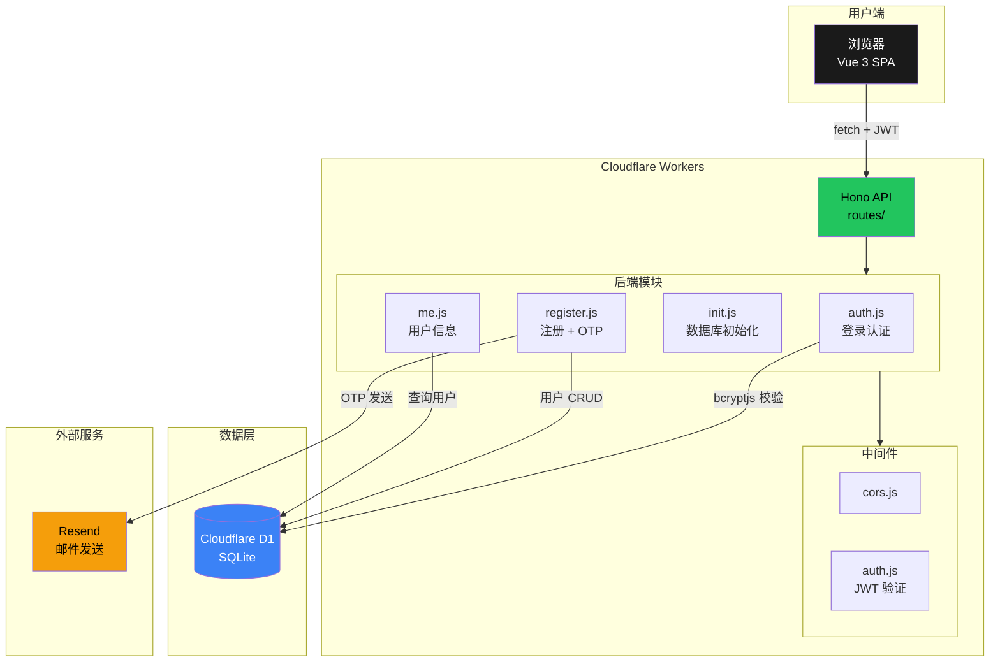
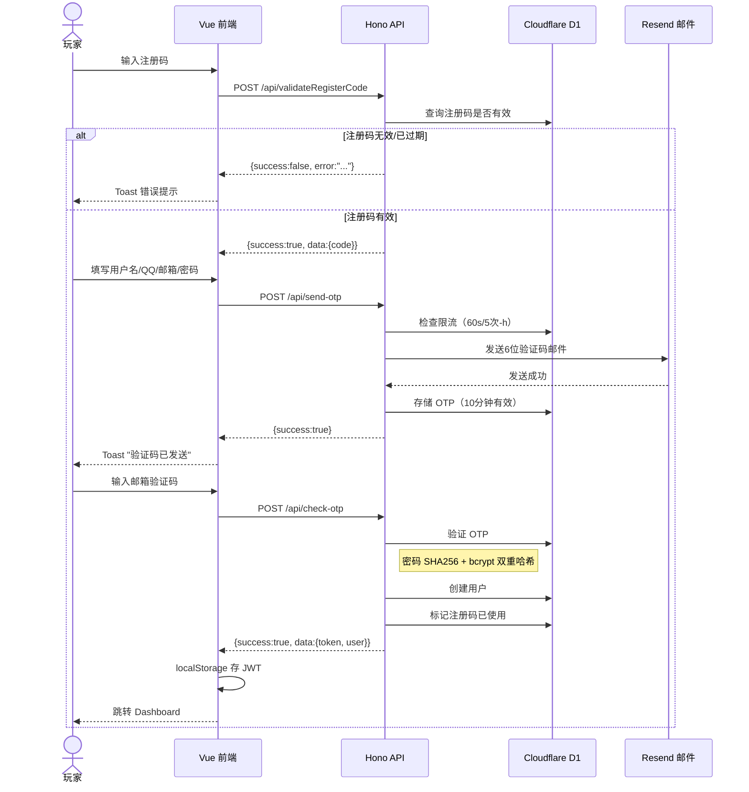
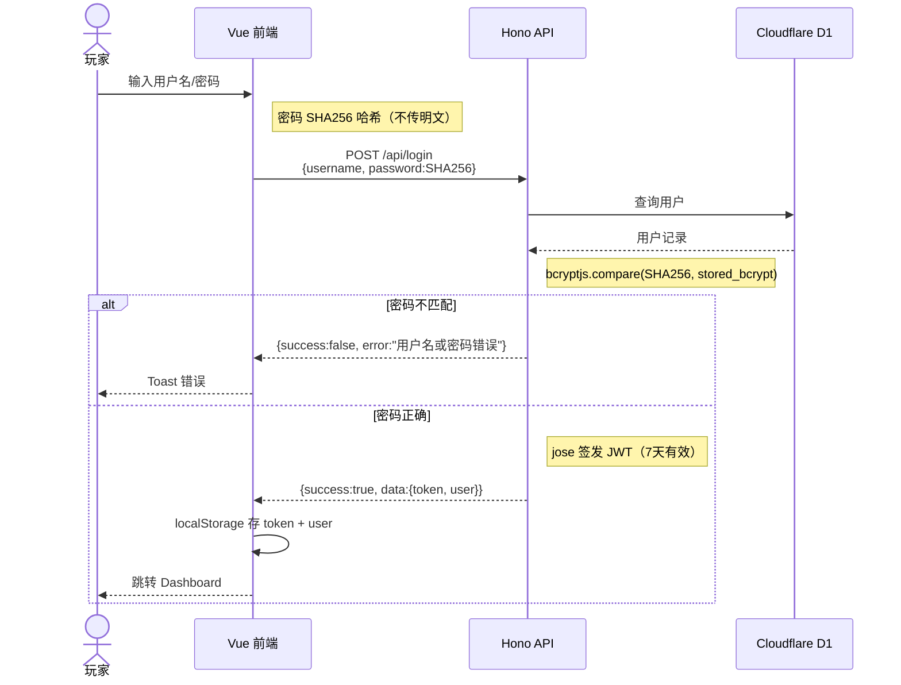
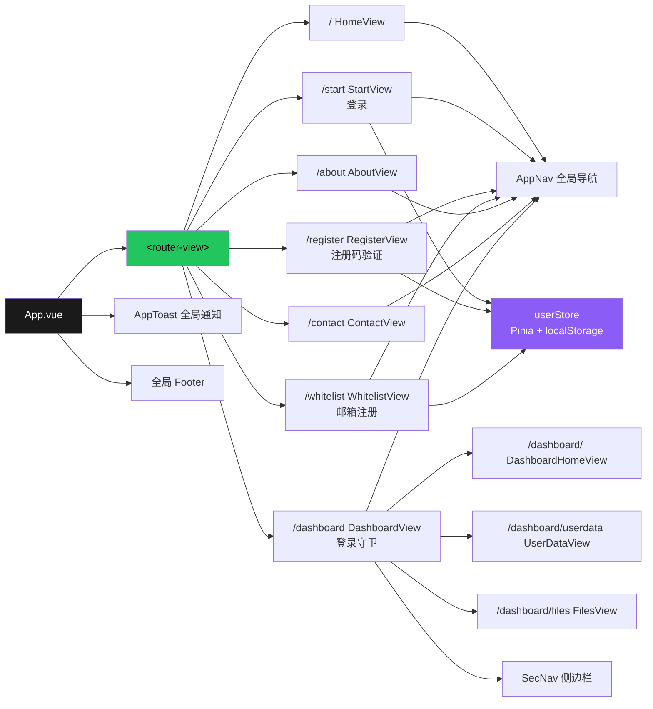
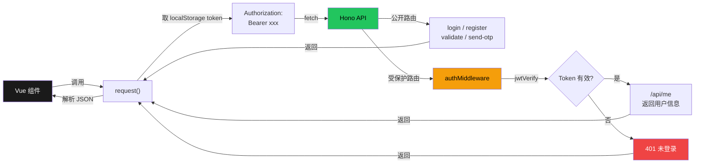

# 糖豆方块屋 (TDFKW)

糖豆方块屋是一个 Minecraft 社区服务器官网项目，提供服务器信息展示、玩家注册、白名单申请和文档中心等功能。

## 技术栈

| 层面 | 技术 |
|---|---|
| 前端框架 | Vue 3 (Composition API) |
| 构建工具 | Vite 8 |
| 状态管理 | Pinia 3 |
| 路由 | Vue Router 5 |
| 后端框架 | Hono 4 (Cloudflare Workers) |
| 数据库 | Cloudflare D1 (SQLite) |
| 邮件服务 | Resend |
| 文档站点 | VitePress |
| 代码规范 | ESLint, Prettier, Oxlint |

## 系统架构



## 用户注册流程



## 登录认证流程



## 前端路由与组件树



## API 请求流（带 JWT）



## 项目结构

```
tdfkw/
├── tdfkw/                       # Vue 3 前端应用
│   ├── src/
│   │   ├── main.js              # 入口文件，注册全局组件
│   │   ├── App.vue              # 根组件：router-view + Toast + footer
│   │   ├── router/index.js      # 路由配置（8条路由，懒加载）
│   │   ├── stores/user.js       # Pinia 用户状态（JWT + localStorage）
│   │   ├── utils/
│   │   │   ├── request.js       # fetch 封装（自动带 JWT）
│   │   │   └── toast.js         # 全局 Toast 通知
│   │   ├── views/               # 10 个页面组件
│   │   │   ├── HomeView.vue     ├── StartView.vue
│   │   │   ├── RegisterView.vue ├── WhitelistView.vue
│   │   │   ├── DashboardView.vue├── DashboardHomeView.vue
│   │   │   ├── UserDataView.vue ├── FilesView.vue
│   │   │   ├── AboutView.vue    └── ContactView.vue
│   │   └── components/
│   │       ├── NAV.vue          # 顶部导航（全局注册 AppNav）
│   │       ├── SecNav.vue       # 侧边栏（全局注册 SecNav）
│   │       └── AppToast.vue     # Toast 通知组件
│   ├── .env / .env.production   # 环境变量（API 地址）
│   └── vite.config.js
├── serve/my-app/                # Hono 后端 API
│   ├── src/
│   │   ├── index.js             # 入口，组合路由
│   │   ├── routes/
│   │   │   ├── auth.js          # POST /api/login
│   │   │   ├── register.js      # 注册码验证 / OTP / 注册
│   │   │   ├── init.js          # GET /api/init
│   │   │   ├── me.js            # GET /api/me（JWT 保护）
│   │   │   └── health.js        # GET /
│   │   ├── middleware/
│   │   │   ├── cors.js          # CORS 中间件
│   │   │   └── auth.js          # JWT 验证中间件
│   │   ├── utils/
│   │   │   ├── response.js      # 统一响应辅助函数
│   │   │   ├── jwt.js           # JWT 签发与验证
│   │   │   └── resend.js        # Resend 客户端工厂
│   │   └── validation.js        # Zod 输入校验 schemas
│   ├── schema.sql               # 数据库 schema 参考
│   ├── wrangler.toml            # Cloudflare Workers + D1 配置
│   └── .dev.vars.example        # 本地密钥模板
├── docs/                        # VitePress 文档站点
└── picture/                     # 静态图片资源
```

## 快速开始

确保安装了 Node.js >=20.19 或 >=22.12。

### 启动后端 API

```bash
cd serve/my-app
npm install
npm run dev          # wrangler dev，默认监听 127.0.0.1:8787
```

### 启动前端应用

```bash
cd tdfkw
npm install
npm run dev          # Vite 开发服务器
```

### 启动文档站点

```bash
cd docs
npm install
npm run docs:dev
```

### 初始化数据库

后端启动后，访问 `GET /api/init` 即可自动创建表结构并插入测试注册码。

## API 接口

| 方法 | 路径 | 鉴权 | 说明 |
|---|---|---|---|---|
| `GET` | `/` | 无 | 健康检查 |
| `GET` | `/api/init` | 无 | 初始化数据库表 |
| `POST` | `/api/validateRegisterCode` | 无 | 验证注册码 |
| `POST` | `/api/send-otp` | 无 | 发送邮箱验证码（含限流） |
| `POST` | `/api/check-otp` | 无 | 校验 OTP 并注册，返回 JWT |
| `POST` | `/api/login` | 无 | 用户登录，返回 JWT |
| `GET` | `/api/me` | JWT | 获取当前用户信息 |

## 服务器信息

- **连接地址**: `mc.tangdoufangkuaiwu.top`
- **游戏版本**: Minecraft 1.20.4 (Fabric)
- **登录方式**: 外置登录 ([Little Skin](https://littleskin.cn/))

## 分支命名规范

- `feature/` — 新功能
- `fix/` — Bug 修复
- `docs/` — 文档更新
- `refactor/` — 代码重构
- `chore/` — 构建/依赖维护

## Pinia 状态管理（前端数据读写指南）

### 什么是 Pinia

Pinia 是 Vue 3 的全局状态管理库，你可以把它理解成一个"**任何页面/组件都能访问的共享变量仓库**"。数据存在 Pinia 里，组件刷新不会丢（配合 localStorage），所有组件随时读写。

### 本项目的 Store

当前只有一个 store——**userStore**，定义在 [tdfkw/src/stores/user.js](tdfkw/src/stores/user.js)：

```
stores/user.js
├── user (ref)        — 用户对象，包含 id, username, qq 等字段
├── isLoggedIn (getter) — 是否已登录（user !== null）
├── setUser(data)     — 写入用户数据
├── loadUser()        — 从 localStorage 恢复
└── logout()          — 退出登录
```

### 在组件中使用

#### 1. 引入并获取 store

```js
// 所有 .vue 文件的 <script setup> 里都可以这样写
import { useUserStore } from '@/stores/user'

const userStore = useUserStore()  // 单例，全局共享同一个
```

#### 2. 读取数据

```html
<template>
  <!-- 直接用，会自动响应式更新 -->
  <p v-if="userStore.isLoggedIn">欢迎，{{ userStore.user.username }}</p>
  <p v-else>未登录</p>

  <!-- 可选链访问嵌套字段 -->
  
</template>
```

```js
// 在 <script setup> 里读
console.log(userStore.user)           // 整个用户对象 或 null
console.log(userStore.user?.qq)       // QQ号
console.log(userStore.isLoggedIn)     // true/false
```

#### 3. 写入数据

```js
// 登录成功后写入（参考 StartView.vue）
const data = await request('/api/login', { ... })
userStore.setUser(data.user)   // data.user 来自后端 API 返回

// 退出登录
userStore.logout()
```

#### 4. 在纯 .js 文件里使用

```js
// 工具函数、路由守卫等非 .vue 文件也可以用
import { useUserStore } from '@/stores/user'

// 注意：必须在 app.use(pinia) 之后调用
const userStore = useUserStore()
console.log(userStore.isLoggedIn)
```

### 数据持久化机制

```
登录/注册 → setUser(data) ────→ user.value = data    (Pinia 内存)
                              └─→ localStorage.setItem('user', ...)  (磁盘)

页面刷新 → loadUser() ────────→ localStorage.getItem('user')
                              └─→ user.value = JSON.parse(saved)  (恢复到内存)
```

`setUser()` 同时写 Pinia 内存和 localStorage，`loadUser()` 在应用启动时（[main.js](tdfkw/src/main.js#L25-L26)）和 Dashboard 挂载时调用，从 localStorage 恢复到内存。所以刷新页面不会丢登录态。

### 完整示例：添加一个新页面读取用户数据

```vue
<!-- src/views/ProfileView.vue -->
<script setup>
import { useUserStore } from '@/stores/user'

const userStore = useUserStore()
</script>

<template>
  <div v-if="userStore.isLoggedIn">
    <p>用户名: {{ userStore.user.username }}</p>
    <p>QQ: {{ userStore.user.qq }}</p>
    <button @click="userStore.logout()">退出</button>
  </div>
  <p v-else>请先登录</p>
</template>
```

### 添加新的 Store（如需要全局配置）

```js
// src/stores/config.js
import { ref } from 'vue'
import { defineStore } from 'pinia'

export const useConfigStore = defineStore('config', () => {
  const theme = ref('light')

  function toggleTheme() {
    theme.value = theme.value === 'light' ? 'dark' : 'light'
  }

  return { theme, toggleTheme }
})
```

使用方式和 userStore 完全一样：`import { useConfigStore } from '@/stores/config'` → `const config = useConfigStore()` → 模板里 `{{ config.theme }}`。

## CSS 开发手册

### 核心原则

1. **所有颜色/圆角/间距必须用 CSS 变量**，禁止硬编码 `#xxxxxx`
2. **所有组件 `<style>` 必须加 `scoped`**，防止样式泄漏
3. **共用样式写到 `assets/main.css`**，不要在组件里复制粘贴
4. **变量统一用 `--color-*` / `--radius-*` / `--space-*` 命名**

### CSS 变量（设计令牌）

定义在 [tdfkw/src/assets/main.css](tdfkw/src/assets/main.css) 的 `:root` 下：

```css
/* 背景 */
--color-bg: #ffffff;
--color-bg-secondary: #f5f5f5;
--color-bg-tertiary: #e8e8e8;

/* 文字 */
--color-text: #1a1a1a;
--color-text-secondary: #666666;
--color-text-muted: #999999;

/* 边框 */
--color-border: #e0e0e0;
--color-border-strong: #949494;

/* 强调/按钮 */
--color-accent: #1a1a1a;
--color-accent-hover: #000000;

/* 圆角 */
--radius-sm: 2px;
--radius-md: 4px;
--radius-lg: 6px;

/* 间距 */
--space-xs: 4px;
--space-sm: 8px;
--space-md: 16px;
--space-lg: 24px;
--space-xl: 32px;
```

### 使用方式

```css
/* ✅ 正确 — 用变量 */
.my-box {
  background: var(--color-bg);
  color: var(--color-text);
  border: 1px solid var(--color-border);
  border-radius: var(--radius-md);
  padding: var(--space-md);
}

/* ❌ 错误 — 硬编码 */
.my-box {
  background: #ffffff;
  color: #1a1a1a;
  border: 1px solid #e0e0e0;
  border-radius: 4px;
  padding: 16px;
}
```

### 全局工具类（main.css 提供）

这些类可以直接在模板里用，不用重复写样式：

| 类名 | 用途 |
|---|---|
| `.card` | 白底 + 边框 + 圆角面板 |
| `.page-center` | 垂直水平居中容器 |
| `.flex-col` | 弹性纵列 |
| `.btn-primary` | 主按钮（黑底白字） |
| `.form-card` | 居中白色表单容器 |
| `.divider` | 灰色分隔线 |

```html
<!-- 示例 -->
<div class="card">
  <h3>标题</h3>
  <p>内容...</p>
</div>

<div class="page-center">
  <div class="form-card">
    <h2>登录</h2>
    ...
  </div>
</div>
```

### 全局基础样式（main.css 自动生效）

以下元素**不需要**在组件里重复定义样式：

- `<a>` — 去掉下划线，颜色 `var(--color-text)`
- `<input>` — 统一边框、圆角、padding、focus 态
- `<button>` / `.btn-primary` — 主按钮样式
- `<h1>` ~ `<h6>` — 统一字重和颜色
- `body` — 统一字体、行高、背景色

### 组件里怎么写

```vue
<!-- ✅ 正确示例 -->
<style scoped>
.container {
  display: flex;
  gap: var(--space-md);
  padding: var(--space-lg);
  background: var(--color-bg);
  border-radius: var(--radius-lg);
}

.title {
  font-size: 1.2rem;
  color: var(--color-text);
  margin-bottom: var(--space-sm);
}
</style>

<!-- ❌ 错误 — 没 scoped，样式会泄漏到全局 -->
<style>
.container {
  ...
}
</style>
```

### scoped 原则

- 每个 vue 组件的 `<style>` **必须**加 `scoped`
- scoped 只防组件内样式往外泄漏，**不防全局样式往里渗**（body、a、input 等全局规则会正常生效）
- 无 scoped 的 `<style>` 只在 `assets/main.css` 里出现（那是故意写全局的）

### 如果要加新颜色/新变量

在 `main.css` 的 `:root` 块里加，不要在各组件里自己定义：

```css
:root {
  --color-success: #10b981;
  --color-danger: #ef4444;
}
```

### 常见场景速查

| 场景 | 写法 |
|---|---|
| 白底面板 | 用 `.card` 类，或 `background: var(--color-bg); border: 1px solid var(--color-border); border-radius: var(--radius-lg);` |
| 灰色背景区 | `background: var(--color-bg-secondary);` |
| 主按钮 | 用 `.btn-primary` 类 |
| 边框 | `border: 1px solid var(--color-border);` |
| 深色边框 | `border: 1px solid var(--color-border-strong);` |
| hover 效果 | `transition: background 0.2s;` 然后 `:hover { background: var(--color-bg-tertiary); }` |
| 头像图 | `border-radius: 50%; border: 1px solid var(--color-border);` |
| 灰色文字 | `color: var(--color-text-secondary);` |

## 生成 Git 分支图

项目自带一个脚本，可以将 `git log --graph` 导出为深色主题的 PNG 长图：

```bash
./generate-git-graph.sh          # 输出 git-graph.png
./generate-git-graph.sh out.png  # 指定文件名
```

**依赖**：`git`、`aha`、`chromium`、`python3`（Pillow + numpy）。脚本可复制到其他仓库通用。

## 参与开发

- **Email**: lanyinxianxuan@163.com
- **GitHub**: [LanYinxianxuan/tdfkw](https://github.com/LanYinxianxuan/tdfkw)

## 开源协议

MIT License

---

Copyright &copy; 2024–2026 糖豆方块屋
